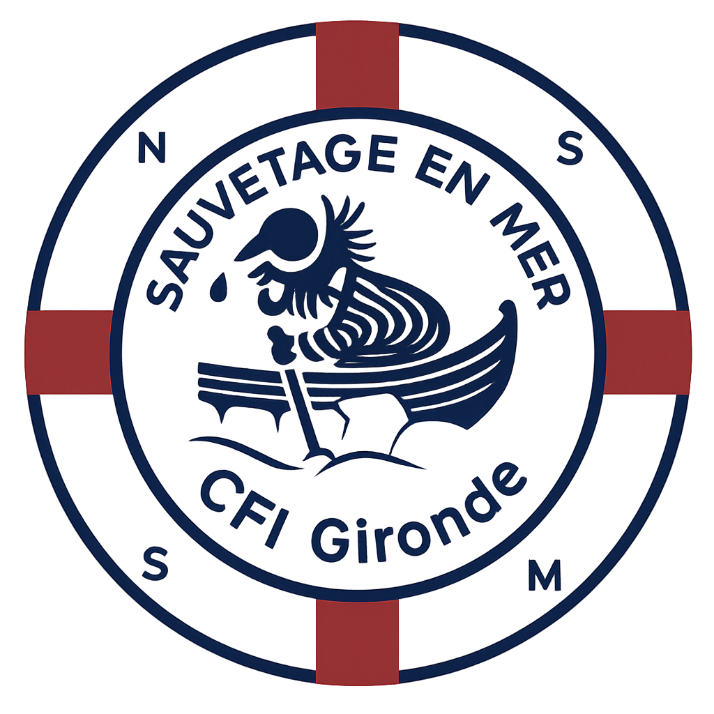

#  SNSM Gironde 

**Site web** du *Centre de Formation et d’Intervention* (CFI) **SNSM de Gironde**. 

 **Accès au site :** [cfi-gironde.fr](https://cfigironde.fr)

## À propos
Le Centre de formation et d'intervention (CFI) de Gironde est l’un des 32 CFI existants en France. 

Il participe depuis 50 ans à la formation des 500 nouveaux nageurs sauveteurs formés par la SNSM.  

Basé sur un engagement bénévole, le centre mobilise des formateurs passionnés pour transmettre leur savoir faire.    
                    

  

## **TO DO LIST**

* Ajouter le **logo CFI**.
* Retravailler les photos du sites sur les pages de formation et présentation.
  * Ajouter **l'affiche visuelle** pour le recrutement (format image optimisée).
  * Intégrer **une photo représentative du CFI**.
* Refaire un calendrier agréable et visuel
* Refaire la page DPS.

---

  

