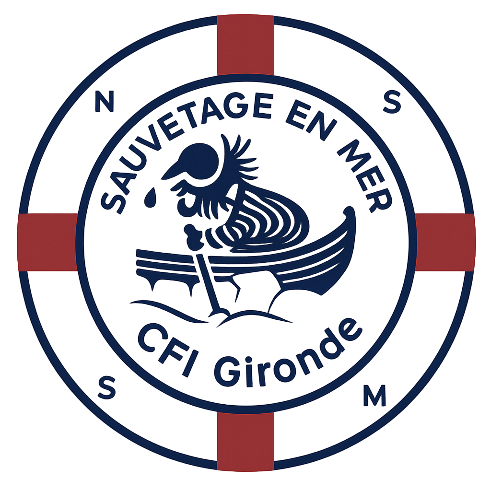

# **TO DO LIST**

## Contenu

* Reprendre des photos pour le site sur les pages de formation et présentation.
  * Intégrer **une photo représentative du CFI**

## Pages DPS

* Vérifier contenu la page (image & texte)

* Ajouter la demande dans [contact.php -- 356](contact.php)

```html
<option value="Demande de DPS" <?php echo (($_POST['motif'] ?? '')==='Demande de DPS')?'selected':''; ?>>Demande de DPS</option>              				
 ```

  * Revoir Menu et taille dans [style.css -- 70](style.css)

```css
  .menu { position: absolute; top: 2.75rem; left: 50%; transform: translateX(-50%); display: flex; justify-content: space-between; width: 550px; list-style: none; }
 ```

## Images Galerie
* Ameliorer noms fichiers, descriptions

```html
 
```

* Lever blocage robots.txt et autoriser son utilisation :

```txt
Disallow: /img/galerie
 ```

 ```txt
Allow: /img/galerie
 ```

## Docs

* [Fichier IA](llms.txt) à éditer et inclure sur le serveur

```txt
# llms.txt – Politique pour les grands modèles de langage (LLMs)
# Documentation : https://llmspecs.com/

User-agent: *
Allow: /

Contact: cfi-gironde@snsm.org
Policy: Le contenu de ce site peut être utilisé par les modèles d'IA pour indexation et création de résumés,
à condition que la source soit mentionnée et qu'aucun contenu du dossier /img/galerie ne soit exploité.

Disallow: /img/album
Disallow: /img/galerie
Disallow: /img/web
Disallow: /phpmailer/
Disallow: calendrier_promo.ics
```

## Others

* Publicité Insta & site **snsm.org**
* Valider DNS search console

<p align="center">
  
</p>